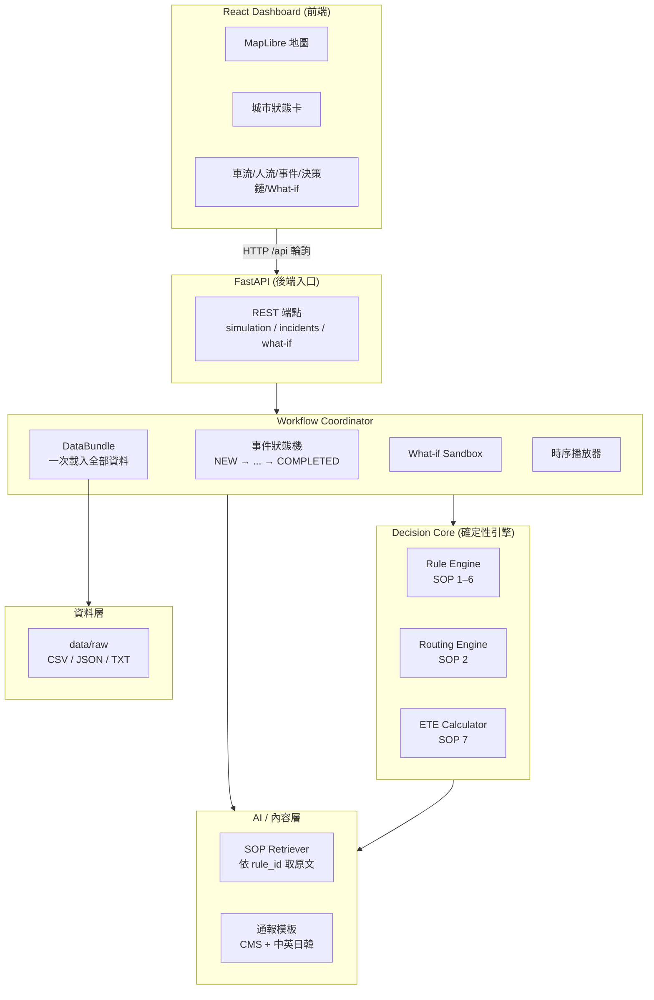
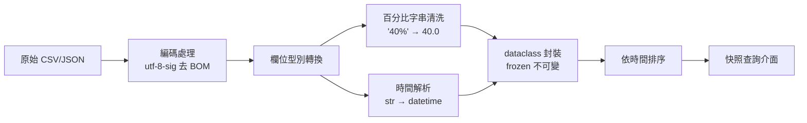
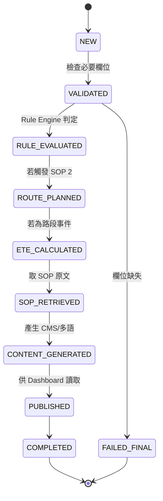
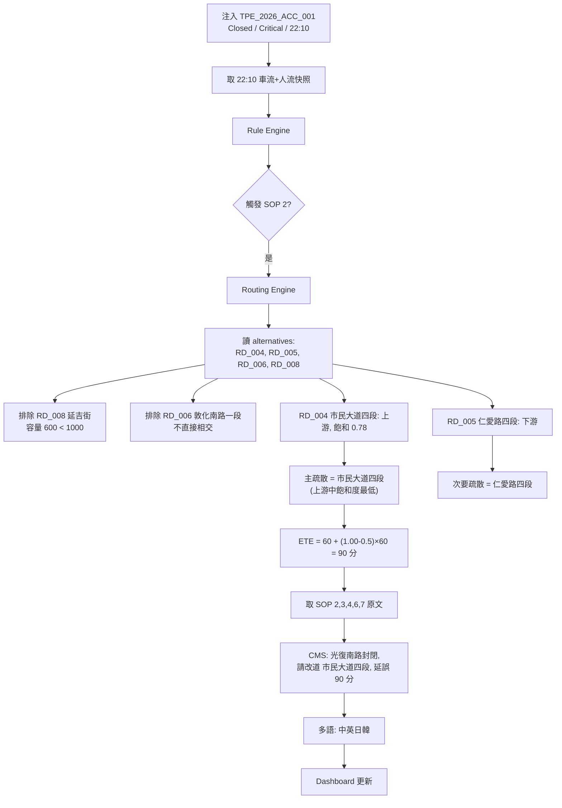
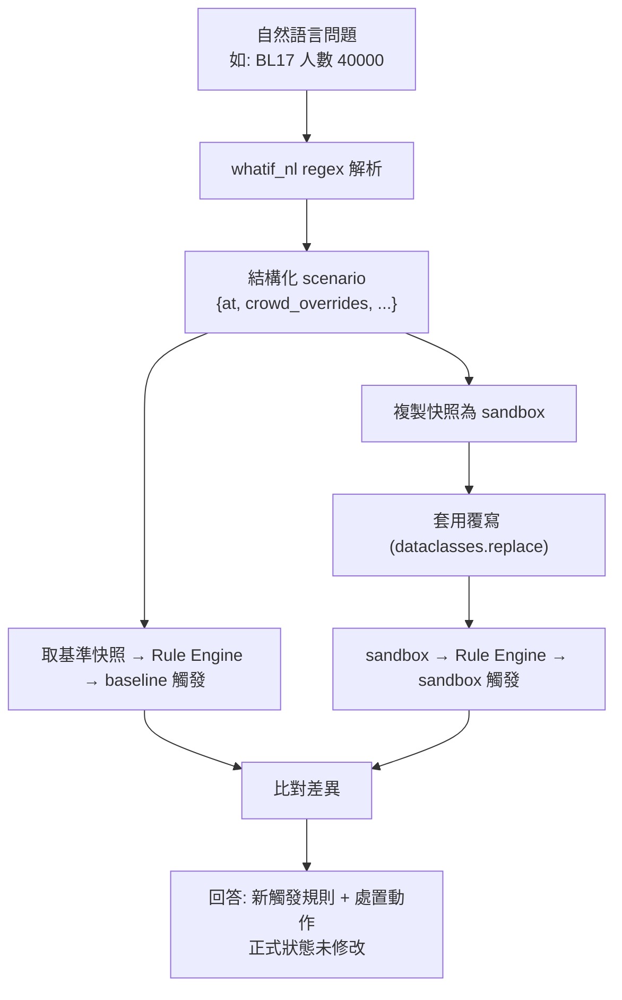

> ⚠️ **本文件為 Phase 1–2 時期的早期快照，內容已過時**（未涵蓋資源調度、可信度評分、
> LLM 生成與護欄、Tool-Calling Agent、通報生命週期、駕駛艙改版等 Phase 3–11 功能）。
> 系統當前的權威技術規格請見 **[SYSTEM_SPECIFICATION.md](SYSTEM_SPECIFICATION.md)**。
> 本檔保留僅供開發歷程參考。

# 城市應變分析 AI Command Center — 完整技術文件（早期版本）

> 2026 雲湧智生：臺灣生成式 AI 應用黑客松（中華電信命題）
> 智慧交通指揮中樞 — 自動感知、事件驅動、可驗證決策、互動問答、多語通報
>
> **文件版本**：2026-07-14｜對應 git commit：Phase 1 + Phase 2
> **核心原則**：SOP 判定、替代路徑、ETE、What-if 全部即時運算；LLM 只負責解釋與多語文字生成。

---

## 目錄

1. [專案定位](#1-專案定位)
2. [技術選型與套件版本](#2-技術選型與套件版本)
3. [專案目錄結構](#3-專案目錄結構)
4. [系統架構](#4-系統架構)
5. [五大功能模組](#5-五大功能模組)
6. [資料集與資料清理](#6-資料集與資料清理)
7. [SOP 規則實作](#7-sop-規則實作)
8. [核心工作流與資料流](#8-核心工作流與資料流)
9. [引擎邏輯詳解](#9-引擎邏輯詳解)
10. [API 規格](#10-api-規格)
11. [前端 Dashboard](#11-前端-dashboard)
12. [測試](#12-測試)
13. [如何啟動](#13-如何啟動)
14. [目前狀態與限制](#14-目前狀態與限制)

---

## 1. 專案定位

一套**事件驅動的城市交通應變指揮中樞**。系統讀取主辦方提供的車流、人流、路網、SOP 與事件資料，完成以下閉環：

```
時序資料播放 → 自動監測車流與人流 → 門檻觸發／事件注入 → SOP 規則判定
→ 路網重規劃 → ETE 計算 → 產生交控建議與多語通報 → Dashboard 即時更新 → 支援 What-if 問答
```

支援兩種模式：

- **主動監測模式**：沿時間軸播放車流、人流資料，系統自行偵測門檻並主動預警。
- **突發事件模式**：注入事件後於 60 秒內完成分析、路徑重規劃與畫面更新（實測為毫秒級）。

### 最重要的設計哲學

```
LLM      → 負責模糊理解與文字生成（架構已預留，目前用確定性模板/regex 佔位）
程式引擎  → 負責確定性判定與數值計算（已完成）
State Machine → 負責流程控制
```

這個切分確保：**即使 LLM 失敗，確定性決策核心仍正常運作**；且每個判定都能追溯到 SOP 原文與原始數值，讓評審驗證「AI 如何感知、判定與處置」。

---

## 2. 技術選型與套件版本

以下為**實際安裝並驗證可運行**的版本（非 requirements 的下限宣告）。

### 開發環境

| 項目 | 版本 |
|---|---|
| 作業系統 | Windows 11 Home (10.0.26200) |
| Python | 3.11.5 (Anaconda) |
| Node.js | 24.18.0 |
| npm | 11.16.0 |
| Git | 2.44.0 |

### 後端（Python）

| 套件 | 已安裝版本 | 用途 |
|---|---|---|
| **fastapi** | 0.111.0 | REST API 框架 |
| **pydantic** | 2.13.4 | 請求/回應資料驗證與序列化 |
| **uvicorn** | 0.29.0 | ASGI server |
| **starlette** | 0.37.2 | FastAPI 底層（CORS middleware 等） |
| **pytest** | 7.4.4 | 測試框架 |
| **httpx** | 0.28.1 | 測試用 HTTP client（TestClient 依賴） |

> 資料處理**刻意只用 Python 標準庫**（`csv`、`json`、`re`、`datetime`、`dataclasses`），因資料量小（百筆等級），不需要 pandas，降低相依與部署負擔。

### 前端（Node / TypeScript）

| 套件 | 已安裝版本 | 用途 |
|---|---|---|
| **react** / **react-dom** | 18.3.1 | UI 框架 |
| **typescript** | 5.9.3 | 型別系統 |
| **vite** | 5.4.21 | 開發伺服器 + 打包工具 |
| **@vitejs/plugin-react** | 4.7.0 | Vite 的 React 支援 |
| **maplibre-gl** | 4.7.1 | 開源地圖引擎（免 API token） |
| **@types/react** | 18.3.31 | React 型別定義 |
| **@types/react-dom** | 18.3.7 | ReactDOM 型別定義 |

> 地圖選 **MapLibre GL JS** 而非 Mapbox，因為 MapLibre 開源、免 access token，底圖使用 CARTO 免費圖磚（dark 主題），Demo 不需申請金鑰即可運行。

---

## 3. 專案目錄結構

```
hackathon/
├─ backend/
│  ├─ app/
│  │  ├─ config.py               # 檔案路徑與全域常數（時間格式）
│  │  ├─ data_loader.py          # 載入 + 清洗 + 時間切面快照
│  │  ├─ notifications.py        # CMS 與中英日韓通報模板（LLM fallback）
│  │  ├─ engines/
│  │  │  ├─ rule_engine.py       # SOP 1–6 確定性判定
│  │  │  ├─ routing_engine.py    # SOP 2 疏散路徑篩選
│  │  │  └─ ete_calculator.py    # SOP 7 ETE 公式
│  │  ├─ retrievers/
│  │  │  └─ sop_retriever.py     # 依 rule_id 精準取 SOP 原文
│  │  ├─ coordinator/
│  │  │  ├─ coordinator.py       # 事件工作流狀態機 + decision trace
│  │  │  ├─ whatif.py            # Sandbox 假設分析
│  │  │  └─ whatif_nl.py         # 自然語言 → 結構化 scenario（regex）
│  │  ├─ simulation/
│  │  │  └─ player.py            # 時序播放器
│  │  └─ api/
│  │     └─ main.py              # FastAPI 端點
│  └─ requirements.txt
├─ frontend/
│  ├─ src/
│  │  ├─ main.tsx                # React 進入點
│  │  ├─ App.tsx                 # 主版面 + 輪詢邏輯
│  │  ├─ api.ts                  # 後端 API 封裝 + TypeScript 型別
│  │  ├─ MapView.tsx             # MapLibre 地圖元件
│  │  ├─ components.tsx          # 狀態卡/清單/事件/決策鏈/What-if 元件
│  │  ├─ geometry.ts             # 示意座標（GeoJSON 用，非官方資料）
│  │  └─ styles.css              # 全域樣式（深色主題）
│  ├─ index.html
│  ├─ package.json
│  ├─ tsconfig.json
│  └─ vite.config.ts             # dev server + /api proxy 設定
├─ data/
│  ├─ raw/                       # 官方資料（authoritative source）
│  │  ├─ city_traffic_flow.csv
│  │  ├─ signaling_crowd_density.csv
│  │  ├─ road_network_geometry.json
│  │  ├─ emergency_traffic_sop.txt
│  │  └─ live_incidents.json
│  └─ DATA_NOTES.md              # 資料版本紀錄與 SHA256
├─ tests/
│  ├─ unit/
│  │  ├─ test_rule_engine.py
│  │  ├─ test_routing_engine.py
│  │  ├─ test_ete_calculator.py
│  │  └─ test_whatif_nl.py
│  └─ integration/
│     └─ test_demo_scenarios.py
├─ docs/
│  └─ PROJECT_DOCUMENTATION.md   # 本文件
├─ conftest.py                   # 測試 sys.path 設定
├─ .claude/launch.json           # 開發伺服器啟動設定
├─ .gitignore
└─ README.md
```

---

## 4. 系統架構

### 分層架構



### 職責邊界

| 元件 | 負責 | 不負責 |
|---|---|---|
| **Coordinator** | 接收 trigger、建立狀態、決定跑哪條工作流、統一發布 | 自己猜路徑、自己算 ETE、自己決定門檻 |
| **Rule Engine** | SOP 1–6 門檻判定、輸出證據數值 | 文字生成、路徑計算 |
| **Routing Engine** | SOP 2 候選篩選與排序 | 最短路徑演算法（MVP 不需要） |
| **LLM（未接）** | 自然語言解析、解釋、多語潤飾 | 判定門檻、修改數值、新增 SOP 條款 |

---

## 5. 五大功能模組

對應主辦方要求的五大必要功能，目前完成狀態：

| 模組 | 狀態 | 實作位置 |
|---|---|---|
| **1. 動態時序監測儀表板** | ✅ | `simulation/player.py` + 前端 |
| **2. 突發事件注入與處置** | ✅ | `coordinator/coordinator.py` |
| **3. 對話式策略諮詢 (What-if)** | ✅ | `coordinator/whatif.py` + `whatif_nl.py` |
| **4. 決策推理與解釋鏈** | ✅ | decision trace + `sop_retriever.py` |
| **5. 多語化全通路通報** | ✅ | `notifications.py` |

### 模組細節

**模組 1 — 動態時序監測**
- 沿資料時間軸推進（15 個車流時間點 + 18 個人流時間點合併去重）
- 每個時間點自動跑 Rule Engine，顯示速度/車流量/飽和度/人數/成長率/漫遊率
- 達 SOP 門檻自動跳出預警
- 支援播放/暫停/跳轉/跳至事件前

**模組 2 — 突發事件注入**
- 三個官方 Demo 事件一鍵注入
- 60 秒內（實測毫秒級）完成路網重規劃、ETE、通報
- 避開事故路段與不符容量規則的路段

**模組 3 — What-if**
- 自然語言問句 → 結構化參數
- Sandbox 執行，正式狀態不變
- 回答引用 SOP 條款與預期動作

**模組 4 — 決策解釋鏈**
- 顯示輸入資料、觸發條件、引用條款、判定結果
- 顯示候選道路及排除理由
- 顯示 ETE 公式與計算明細

**模組 5 — 多語通報**
- 任一基地台漫遊率 ≥ 30% 觸發
- 中英必做，日韓加分（本系統四語全做）
- 時間格式統一 `YYYY-MM-DD HH:MM`

---

## 6. 資料集與資料清理

### 6.1 五份官方資料概況

| 檔案 | 內容 | 筆數 | 維度 |
|---|---|---|---|
| `city_traffic_flow.csv` | 15 條核心路段交通時序 | 112 筆 | 15 路段 × 15 時間點 |
| `signaling_crowd_density.csv` | 基地台/場站人流時序 | 36 筆 | 9 場站 × 18 時間點 |
| `road_network_geometry.json` | 路網拓撲、容量、替代道路 | 15 路段 | — |
| `emergency_traffic_sop.txt` | 交通應變 SOP | 7 條規則 | — |
| `live_incidents.json` | Demo 事件 | 3 個 | — |

時間範圍：2026-05-20 17:00 ~ 23:30。

### 6.2 資料清理規則（`data_loader.py`）

清理是這個系統的地基，錯一個欄位整條決策鏈就歪。實作重點：



**① 百分比欄位清洗** — `signaling_crowd_density.csv` 的 `Roaming_User_Pct` 是帶 `%` 的字串（如 `"40%"`、`"5%"`）：

```python
def _parse_pct(value: str) -> float:
    m = re.match(r"^\s*([0-9.]+)\s*%?\s*$", value)
    if not m:
        raise ValueError(f"無法解析百分比欄位: {value!r}")
    return float(m.group(1))   # "40%" → 40.0
```

清洗後全系統以數值 `40.0` 比對 `>= 30`，不再碰字串。

**② 時間統一** — 所有 `Timestamp` 以 `%Y-%m-%d %H:%M` 解析為 `datetime`，輸出時再格式化回同樣字串（SOP 第 6 條要求時間格式統一）。

**③ 編碼** — CSV 以 `utf-8-sig` 讀取，自動去除 Windows Excel 可能寫入的 BOM，避免第一個欄位名變成 `Timestamp`。

**④ 不可變封裝** — 每列資料轉成 `frozen=True` 的 dataclass（`TrafficRecord` / `CrowdRecord` / `RoadSegment`），避免下游意外改到原始資料；What-if 需要覆寫時用 `dataclasses.replace()` 產生新副本。

**⑤ 排序** — 載入後依 timestamp 排序，讓「取某時刻的最新快照」可以線性掃描。

### 6.3 快照查詢介面

系統以「時間切面」為核心概念，提供三個查詢函式：

| 函式 | 語意 |
|---|---|
| `traffic_snapshot(records, at)` | 每條路段在 `at`（含）之前的**最新一筆** |
| `crowd_snapshot(records, at)` | 每個場站在 `at`（含）之前的最新一筆 |
| `crowd_peak(records, bs_id, until)` | 某場站在 `until` 前的**歷史峰值**人數（SOP 4 用） |
| `all_timestamps(traffic, crowd)` | 合併去重後的所有時間點（播放器推進用） |

### 6.4 路網檔版本差異處理（重要）

Downloads 內有兩份 `road_network_geometry.json`，其中 **3 條路段的 `intersections` 順序不同**。由於順序代表上游→下游、會直接影響 Routing Engine 的上下游判定，必須明確擇一：

| 路段 | 散檔版順序 | 官方資料夾版（採用） |
|---|---|---|
| RD_TPE_001 忠孝東路四段 | 延吉街→光復南路→基隆路一段 | **光復南路→延吉街→基隆路一段** |
| RD_TPE_011 松壽路 | 基隆路一段→市府路→松智路 | **基隆路一段→松智路→市府路** |
| RD_TPE_013 信義路五段 | 基隆路一段→市府路→松智路 | **基隆路一段→松智路→市府路** |

**採用官方命題資料夾版為唯一 authoritative source**，系統只讀 `data/raw/`，並以 SHA256 標記版本（見 `data/DATA_NOTES.md`）：

```
SHA256: 05FE3CAF3834819E5C12018953502B582ECE6178639635FA600DE8D935054758
```

核心 Demo 事件 ACC_001（光復南路 RD_TPE_002）的 intersections 兩版一致，主場景不受影響。

---

## 7. SOP 規則實作

7 條 SOP 全部以確定性程式實作，門檻直接對應 SOP 原文。

### SOP 1 — 交通壅塞分級

```
Normal：Saturation_Score < 0.85
B 級：  0.85 ≤ Saturation_Score < 0.95   （黃燈）
A 級：  Saturation_Score ≥ 0.95           （紅燈）
```

城市應變觸發路段：`RD_TPE_001` 忠孝東路、`RD_TPE_002` 光復南路。
- B 級：通報交控中心、替代道路綠燈 +25%、警力淨空路口
- A 級：再加啟動替代路徑引導（SOP 2）

### SOP 2 — 車禍與路障（需三項同時成立）

```
status ∈ {Closed, Blocked, Restricted}
severity ∈ {High, Critical}
affected_segment 以 RD_ 開頭
```

### SOP 3 — 捷運與接駁分流（任一成立）

```
BS_MRT_BL17 Growth_Rate > 0.30  或  User_Count > 25,000
```

動作：北捷過站不停、公車處調度接駁專車、引導步行至 BS_MRT_BL18。

### SOP 4 — 大巨蛋散場（需同時成立）

```
BS_TPE_DOME 歷史峰值 ≥ 30,000  且  當前 Growth_Rate ≤ -0.20
```

### SOP 5 — 號誌故障（任一成立）

```
type = Power_Failure  或  description 含「號誌失效」或「故障」
```

### SOP 6 — 多語通報

```
任一基地台 Roaming_User_Pct ≥ 30%
```

### SOP 7 — ETE 預計恢復時間

```
ETE_minutes = base_clearance + congestion_penalty

base_clearance：Critical=60、High=40、Medium=20
congestion_penalty = max(0, (受影響路段平均 Saturation_Score - 0.5) × 60)
```

---

## 8. 核心工作流與資料流

### 8.1 事件注入工作流（狀態機）



每一步都寫入 `decision_trace`（含步驟名、時間戳、細節），就是前端決策鏈時間軸的資料來源。任何步驟拋例外都被捕捉、記入 `errors`，並保留已完成的部分結果（fallback 原則）。

### 8.2 事件注入資料流（以 ACC_001 光復南路塌陷為例）



### 8.3 時序播放資料流


### 8.4 What-if 資料流（Sandbox 隔離）



---

## 9. 引擎邏輯詳解

### 9.1 Routing Engine（最有邏輯含量的部分）

**不是最短路徑演算法，而是 SOP 約束下的候選篩選**。步驟：

1. 候選只來自事故路段自己的 `alternatives`（**單向建議，不可反向推導對稱**）
2. 排除 `capacity_vph < 1000` 的候選
3. 候選必須與事故路段**直接相交**（出現在其 `intersections` 中）
4. 用**事故位置文字** + `intersections` 上游→下游排序，判定候選在上游或下游
5. 上游候選依 `Saturation_Score` 由低至高排序，**第一名為主疏散**
6. 下游相交幹道**只列次要疏散**
7. 主疏散若已壅塞（≥ 0.85）仍保留，但改掛「長綠燈時制 + 併行大眾運輸」建議
8. 所有被排除的候選記下 `reason_code`

排除理由代碼：`CAPACITY_BELOW_1000`、`NOT_DIRECT_INTERSECTION`、`UNKNOWN_SEGMENT`。
主疏散理由代碼：`UPSTREAM`、`DIRECT_INTERSECTION`、`CAPACITY_OK`、`LOWEST_SATURATION`、（壅塞時）`CONGESTED_KEEP_WITH_LONG_GREEN`。

**上下游判定邏輯**：事故位置文字（如「光復南路與忠孝東路口南側」）比對 `intersections`，找到對應路口 index；index 更大者視為下游。找不到位置時，所有相交候選一律視為上游（保守處理）。

### 9.2 ETE Calculator

```python
ETE_minutes = base_clearance + max(0, (avg_saturation - 0.5) * 60)
```

- **後端保留原始小數**（如 81.6），**UI 才四捨五入**（82）— 分離 `ete_minutes` 與 `ete_minutes_display` 兩個欄位
- 懲罰項不得為負（`max(0, ...)`）
- 回傳含完整 `formula` 字串供決策鏈展示

### 9.3 SOP Retriever

**不靠 embedding 決定適用條款**，而是依「程式已觸發的 rule_id」精準取回 SOP 原文。這確保引用的條款一定正確，符合技術文件「不可只依 embedding 直接決定適用條款」的要求。SOP txt 檔以分隔線 + `N. 標題` 切成 7 個 chunk。

### 9.4 通報生成（LLM Fallback 設計）

依技術文件 20.3：即使 LLM 失敗，仍須以模板產出 CMS 與多語訊息。因此**模板為第一層實作**，LLM 潤飾屬未來加分。

- CMS 格式（SOP 2b）：`<事故路段>封閉，請改道 <主疏散路段>，預計延誤 <ETE> 分鐘`
- 多語（SOP 6）：中/英/日/韓四語，各含統一時間戳
- 路段英文名以固定對照表提供（主辦資料無英文名）

---

## 10. API 規格

Base URL：`http://localhost:8000`

### 時序播放

| 方法 | 路徑 | 說明 |
|---|---|---|
| POST | `/api/simulation/start` | 啟動播放（body: `speed`, `start_timestamp`） |
| POST | `/api/simulation/pause` | 暫停 |
| POST | `/api/simulation/seek` | 跳轉（body: `timestamp`） |
| POST | `/api/simulation/tick` | 推進一個時間點 |
| GET | `/api/simulation/state` | 當前狀態 |
| GET | `/api/simulation/alerts` | 累積預警記錄 |

### 事件與 What-if

| 方法 | 路徑 | 說明 |
|---|---|---|
| POST | `/api/incidents/inject` | 注入事件（body: `event_id`） |
| GET | `/api/incidents` | 可用/已處理事件列表 |
| GET | `/api/incidents/{id}` | 事件完整狀態 |
| GET | `/api/incidents/{id}/decision-trace` | 決策鏈 |
| GET | `/api/incidents/{id}/notifications` | CMS 與多語通報 |
| POST | `/api/what-if` | 結構化 What-if |
| POST | `/api/what-if/nl` | 自然語言 What-if（body: `question`） |

### 基礎資料

| 方法 | 路徑 | 說明 |
|---|---|---|
| GET | `/api/health` | 健康檢查 |
| GET | `/api/road-network` | 路網資料 |
| GET | `/api/sop` | SOP 7 條原文 |

### 範例：注入事件回應（節錄）

```json
{
  "incident_id": "TPE_2026_ACC_001",
  "workflow_status": "completed",
  "triggered_rules": [2, 3, 4, 6],
  "routing_result": {
    "primary_route": { "segment_id": "RD_TPE_004", "name": "市民大道四段", ... },
    "secondary_routes": [ { "segment_id": "RD_TPE_005", "role_reason": "DOWNSTREAM" } ],
    "excluded_routes": [
      { "segment_id": "RD_TPE_008", "reason_code": "CAPACITY_BELOW_1000" },
      { "segment_id": "RD_TPE_006", "reason_code": "NOT_DIRECT_INTERSECTION" }
    ]
  },
  "ete_result": { "ete_minutes": 90.0, "formula": "ETE = 60 + max(0, (1.0000 - 0.5) × 60) = 90.00 分鐘" },
  "notifications": {
    "cms": "光復南路封閉，請改道 市民大道四段，預計延誤 90 分鐘",
    "multilingual_required": true,
    "messages": { "zh": "...", "en": "...", "ja": "...", "ko": "..." }
  },
  "decision_trace": [ { "step": "VALIDATED", ... }, ... ]
}
```

---

## 11. 前端 Dashboard

### 版面配置

```
┌─────────────────────────────────────────────────────────┐
│ Header：標題｜模擬時間/系統時間｜播放控制                  │
├─────────────────────────────────────────────────────────┤
│ 狀態卡：城市警戒｜進行中事件｜ETE｜觸發SOP｜多語通報       │
├───────────────┬─────────────────────┬───────────────────┤
│ 車流監測       │ MapLibre 主地圖      │ 事件注入          │
│ 人流監測       │ (飽和度/疏散/事故)   │ (疏散/ETE/SOP/通報)│
│               │ 自動預警流           │                   │
├───────────────┴─────────────────────┴───────────────────┤
│ Agent 決策鏈時間軸        │ What-if 對話                 │
└───────────────────────────┴─────────────────────────────┘
```

### 地圖圖層（MapLibre）

| 圖層 | 呈現 |
|---|---|
| 路段飽和度 | Line，綠(<0.85)/黃(<0.95)/紅(≥0.95)/灰(無資料) |
| 封閉路段 | 深紅粗虛線 |
| 主疏散 | 青色粗實線 |
| 次要疏散 | 白色虛線 |
| 基地台/場站 | Circle，半徑依人數，漫遊 ≥30% 轉紫 |
| 事故點 | 紅色圓點 |

> hover 路段/場站顯示即時數值 popup。地圖座標為**示意用近似經緯度**（主辦資料未提供座標），畫面明確標註「處置判定不使用這些座標」。

### 資料更新機制

前端每 2.5 秒輪詢後端：播放中呼叫 `/tick` 推進、非播放呼叫 `/state`。透過 Vite proxy 把 `/api/*` 轉到後端 8000 埠。

---

## 12. 測試

**38 項測試全數通過**（`python -m pytest tests -q`）。

| 檔案 | 涵蓋 |
|---|---|
| `unit/test_rule_engine.py` | 分級邊界(0.84/0.85/0.95)、BL17 門檻、漫遊 30%、SOP 4 雙條件、SOP 2 三條件、SOP 5 |
| `unit/test_routing_engine.py` | 容量 999 排除、不相交排除、下游不可為主疏散、壅塞仍保留、alternatives 不可雙向、無位置預設上游 |
| `unit/test_ete_calculator.py` | Critical+0.5=60、High+0.8=58、Medium 懲罰不為負、文件範例 81.6、多路段平均、後端保留原值 |
| `unit/test_whatif_nl.py` | 人數/萬倍數/別名/漫遊/時間/封路/負成長率/長別名優先/無法解析 |
| `integration/test_demo_scenarios.py` | 三個官方事件端到端、What-if、主動監測門檻、資料載入驗證 |

已驗證的 Demo 場景結果：

| 場景 | 結果 |
|---|---|
| 主動監測 | 21:00 忠孝東路 B 級、21:30 A 級自動預警 |
| 光復南路塌陷 (ACC_001) | 主疏散市民大道四段；延吉街(容量)、敦化南路一段(不相交)排除；仁愛路四段列下游；ETE 90 分 |
| BL17 人群推擠 (EVT_002) | 觸發 SOP 3（31,000>25,000）；ETE 70 分 |
| 松高路號誌故障 (EVT_003) | 觸發 SOP 5；ETE 41 分 |
| 多語通報 | 台北101 漫遊 45% 觸發 SOP 6，中英日韓同步 |
| What-if | BL17 覆寫 40,000 → sandbox 觸發 SOP 3，正式狀態不變 |

---

## 13. 如何啟動

### 後端

```powershell
cd C:\Users\LIYUN\Desktop\hackathon\backend
pip install -r requirements.txt
python -m uvicorn app.api.main:app --reload --port 8000
```

### 前端（另開終端機）

```powershell
cd C:\Users\LIYUN\Desktop\hackathon\frontend
npm install
npm run dev
```

前端預設 http://localhost:5173（被占用會自動換埠），`/api` 自動 proxy 到後端 8000。

### 測試

```powershell
cd C:\Users\LIYUN\Desktop\hackathon
python -m pytest tests -q
```

---

## 14. 目前狀態與限制

### 已完成

- ✅ 後端確定性決策核心（Rule / Routing / ETE 引擎）
- ✅ Coordinator 事件狀態機 + 完整 decision trace
- ✅ What-if Sandbox + 自然語言 regex 解析
- ✅ 時序播放器 + 自動監測
- ✅ CMS + 中英日韓通報模板
- ✅ React + MapLibre Dashboard（瀏覽器實測通過）
- ✅ 38 項測試全綠
- ✅ git 版控（3 個 commit）

### 尚未做（誠實交代）

- **LLM 尚未真正接入**：通報用模板、What-if 解析用 regex。架構已為 LLM 預留位置（輸出同一份 scenario / 通報格式即可插入），目前跑確定性版本反而穩定、不會被 LLM 逾時卡住。
- **WebSocket 即時推送**：目前用 2.5 秒輪詢，Demo 已足夠。
- **H3 區域風險熱區**：技術文件的加分項，尚未實作。
- **AWS 部署**：尚未部署（規劃 S3 + App Runner/ECS + RDS）。
- **GitHub remote**：目前僅本地 git，尚未推上遠端。
- **比賽交付物**：提案簡報與 Demo 錄影尚未製作。

### 地圖座標說明

主辦資料只提供路網邏輯（intersections、容量、替代道路），未提供經緯度。前端 `geometry.ts` 的座標為信義/大安區實際路網的**近似示意位置**，僅供視覺化，**所有 SOP 判定、路徑篩選、ETE 計算都不使用這些座標**，畫面上亦明確標註。

---

## 附錄：設計原則總結

1. 五大模組是**使用者功能**，不是五個自由對話 Agent。
2. 一個 Coordinator 管理流程，所有模組共用同一份 Incident State。
3. **SOP、Routing、ETE 必須由程式運算。**
4. LLM 只負責自然語言解析、解釋與多語生成。
5. 地圖是決策呈現，不是城市遊戲模擬。
6. Demo 劇本可固定，但結果需依當下資料真正運算。
7. 系統保留完整 Decision Trace，讓評審看見 AI 如何感知、判定與處置。
8. **即使 LLM 失敗，確定性決策核心仍正常運作。**
