# CitySentinel 城市應變 AI Command Center — 系統規格文件

| 項目 | 內容 |
|---|---|
| 系統名稱 | CitySentinel 城市應變分析 AI Agent |
| 命題單位 | 中華電信（2026 雲湧智生：臺灣生成式 AI 應用黑客松競賽） |
| 文件版本 | v1.0 |
| 對應程式版本 | Phase 1–11（git commit `b37bc2f`） |
| 文件狀態 | 與執行中系統核對完成，所有數值取自實際程式碼與測試結果 |

> 本文件為系統當前的權威技術規格。`PROJECT_DOCUMENTATION.md` 為 Phase 1–2 時期的早期快照，內容已過時，請以本文件為準。

---

## 目錄

1. [系統概述](#1-系統概述)
2. [執行環境](#2-執行環境)
3. [使用技術與版本](#3-使用技術與版本)
4. [使用的資料](#4-使用的資料)
5. [資料前處理](#5-資料前處理)
6. [系統架構](#6-系統架構)
7. [系統功能](#7-系統功能)
8. [核心流程圖](#8-核心流程圖)
9. [API 規格](#9-api-規格)
10. [資料模型](#10-資料模型)
11. [測試規格](#11-測試規格)
12. [效能與限制](#12-效能與限制)
13. [部署架構](#13-部署架構)
14. [已知限制與後續規劃](#14-已知限制與後續規劃)

---

## 1. 系統概述

### 1.1 定位

CitySentinel 是一套**事件驅動的城市交通應變指揮系統**。系統讀取交通、電信人流、路網、SOP 與事件資料，完成以下閉環：

```
時序資料播放 → 自動監測異常 → SOP 門檻觸發 → 事件建立與可信度評估
→ 路網重規劃 → ETE 計算 → 資源調度 → 多語通報 → 人工核准發布
→ 民眾端接收 → 完整稽核紀錄
```

系統支援兩種運作模式：

| 模式 | 觸發方式 | 說明 |
|---|---|---|
| 主動監測模式 | 時序播放自動推進 | 沿資料時間軸偵測門檻，自動產生預警與 LLM 情勢摘要 |
| 突發事件模式 | 管理員注入事件 | 接收事件後完成分析、路徑重規劃、資源調度與通報生成 |

### 1.2 核心設計原則

```
LLM           →  模糊理解與文字生成（諮詢層，唯讀權限）
確定性引擎     →  判定與數值計算（決策層，LLM 不可觸碰）
狀態機         →  流程控制與稽核軌跡
人             →  最終決策權（核准、調整、拒絕）
```

此分層確保四項特性：

| 特性 | 實作方式 |
|---|---|
| **可重現** | 相同輸入必得相同判定結果，105 項測試鎖定邊界條件 |
| **可驗證** | 決策鏈保留輸入快照、觸發條款、排除理由、公式明細；資料附 SHA256 |
| **可質疑** | 每個調度動作附證據包與 Challenge 問題，可接受／調整／拒絕 |
| **不中斷** | LLM 失效時自動降級為確定性模板，事件流程照常完成 |

---

## 2. 執行環境

### 2.1 開發與驗證環境

| 項目 | 版本 |
|---|---|
| 作業系統 | Windows 11 Home 24H2（10.0.26200） |
| Python | 3.11.5（Anaconda 發行版） |
| Node.js | 24.18.0 |
| npm | 11.16.0 |
| Git | 2.44.0.windows.1 |
| 瀏覽器 | Chromium 系列（需支援 WebGL 以渲染地圖） |

### 2.2 執行需求

| 項目 | 需求 |
|---|---|
| Python | ≥ 3.10（使用 `X \| Y` 型別語法與 `match` 相容寫法） |
| Node.js | ≥ 18（Vite 5 需求） |
| 記憶體 | ≥ 2 GB（資料全載入記憶體，實際佔用 < 200 MB） |
| 網路 | 地圖圖磚需連外；LLM 功能需連外，離線時自動降級為模板 |
| 連接埠 | 後端 8000、前端 5173（可調整） |

### 2.3 環境變數

| 變數 | 必要性 | 用途 |
|---|---|---|
| `ANTHROPIC_API_KEY` | 選用 | 啟用 Claude（優先） |
| `OPENAI_API_KEY` | 選用 | 啟用 OpenAI（次選） |
| `CITY_LLM_DISABLED` | 選用 | 設為 `1` 強制停用 LLM，測試環境使用以確保確定性 |

> 兩把金鑰皆未設定時，系統以確定性模板運作，所有功能仍可完整展示。

### 2.4 啟動方式

```bash
# 後端（專案根目錄下）
cd backend
pip install -r requirements.txt
python -m uvicorn app.api.main:app --reload --port 8000

# 前端（另開終端機）
cd frontend
npm install
npm run dev          # 預設 http://localhost:5173，/api 代理至 8000

# 測試（專案根目錄）
python -m pytest tests -q
```

---

## 3. 使用技術與版本

### 3.1 後端

| 套件 | 版本 | 用途 |
|---|---|---|
| **fastapi** | 0.111.0 | REST API 框架 |
| **pydantic** | 2.13.4 | 請求驗證、LLM 結構化輸出 schema |
| **uvicorn** | 0.29.0 | ASGI 伺服器 |
| **starlette** | 0.37.2 | FastAPI 底層（CORS middleware） |
| **anthropic** | 0.116.0 | Claude SDK（LLM 首選） |
| **openai** | 2.31.0 | OpenAI SDK（LLM 次選） |
| **pytest** | 7.4.4 | 測試框架 |
| **httpx** | 0.28.1 | 測試用 HTTP client（TestClient 依賴） |

> **資料處理刻意只用 Python 標準庫**（`csv`、`json`、`re`、`datetime`、`dataclasses`、`hashlib`）。資料量為百筆等級，引入 pandas 只會增加相依與部署負擔而無實益。

### 3.2 前端

| 套件 | 版本 | 用途 |
|---|---|---|
| **react** / **react-dom** | 18.3.1 | UI 框架 |
| **typescript** | 5.9.3 | 型別系統 |
| **vite** | 5.4.21 | 開發伺服器與打包工具 |
| **@vitejs/plugin-react** | 4.7.0 | Vite React 支援 |
| **maplibre-gl** | 4.7.1 | 開源地圖引擎（免 access token） |
| **@types/react** / **@types/react-dom** | 18.3.31 / 18.3.7 | 型別定義 |

> **地圖選用 MapLibre GL JS 而非 Mapbox**：MapLibre 為開源且免申請金鑰，底圖使用 CARTO 免費圖磚，Demo 環境零設定即可運行。系統未使用任何需付費授權的元件。

### 3.3 AI 模型

| 項目 | 設定 |
|---|---|
| 首選模型 | `claude-opus-4-8`（Anthropic） |
| 次選模型 | `gpt-4o-mini`（OpenAI） |
| 逾時設定 | 15 秒 |
| 選用邏輯 | 依環境變數自動偵測，兩者皆無則使用確定性模板 |
| 結構化輸出 | Anthropic 使用 `messages.parse()`；OpenAI 使用 JSON mode + schema 注入 + Pydantic 驗證 |

### 3.4 開發工具

| 工具 | 用途 |
|---|---|
| Git | 版本控制 |
| pytest | 自動化測試（105 項） |
| TypeScript Compiler (`tsc --noEmit`) | 前端型別檢查 |
| pptxgenjs 4.0.1 | 提案簡報產生器（`docs/build_deck.cjs`，非系統執行相依） |
| LibreOffice | 簡報轉 PDF（文件產出用） |

---

## 4. 使用的資料

### 4.1 資料總覽

系統使用主辦方提供的五份資料，**全部進入決策路徑**，無任何純展示用資料。

| 檔案 | 筆數 | 維度 | 系統用途 |
|---|---|---|---|
| `city_traffic_flow.csv` | 112 筆 | 15 路段 × 15 時間點 | 壅塞分級、路徑飽和度排序、ETE 懲罰項、可信度佐證 |
| `signaling_crowd_density.csv` | 36 筆 | 9 場站 × 18 時間點 | 捷運分流判定、大巨蛋散場偵測、多語通報觸發 |
| `road_network_geometry.json` | 15 路段 | — | 候選路徑來源、容量篩選、上下游判定 |
| `emergency_traffic_sop.txt` | 7 條規則 | — | 門檻定義、條款檢索、LLM 引用驗證基準 |
| `live_incidents.json` | 3 事件 | — | 事件注入、可信度來源評分 |

資料時間範圍：**2026-05-20 17:00 – 23:30**

### 4.2 欄位規格

#### 4.2.1 `city_traffic_flow.csv`

| 欄位 | 型別 | 說明 | 系統使用 |
|---|---|---|---|
| `Timestamp` | 字串 → datetime | 資料時間 | 時間切面對齊 |
| `Segment_ID` | 字串 | 路段 ID（`RD_TPE_XXX`） | 主鍵，關聯路網 |
| `Road_Name` | 字串 | 路段名稱 | 顯示與 CMS 文字 |
| `Avg_Speed` | float | 平均時速 | 可信度評估（崩跌判定） |
| `Vehicle_Count` | int | 車流量 | 顯示 |
| `Saturation_Score` | float | 飽和度 0–1 | **分級判定、路徑排序、ETE 計算** |
| `Lane_Status` | 字串 | 車道狀態 | 可信度交叉驗證 |

#### 4.2.2 `signaling_crowd_density.csv`

| 欄位 | 型別 | 說明 | 系統使用 |
|---|---|---|---|
| `Timestamp` | 字串 → datetime | 資料時間 | 時間切面對齊 |
| `BS_ID` | 字串 | 基地台／場站 ID（`BS_XXX`） | 主鍵 |
| `Location_Name` | 字串 | 地點名稱 | 顯示 |
| `User_Count` | int | 使用者數 | **SOP 3 門檻（>25,000）、SOP 4 歷史峰值** |
| `Stay_Time_Avg` | float | 平均停留時間 | 顯示 |
| `Growth_Rate` | float | 人流成長率 | **SOP 3（>0.30）、SOP 4（≤−0.20）** |
| `Roaming_User_Pct` | 字串 → float | 漫遊比例（帶 `%`） | **SOP 6 門檻（≥30%）** |

#### 4.2.3 `road_network_geometry.json`

| 欄位 | 型別 | 說明 | 系統使用 |
|---|---|---|---|
| `segment_id` | 字串 | 路段 ID | 主鍵 |
| `name` | 字串 | 路段名稱 | 相交比對、顯示 |
| `flow_direction` | 字串 | 車流方向 | 上下游判定參考 |
| `intersections` | 陣列 | 相交道路（**上游→下游排序**） | **直接相交驗證、上下游判定** |
| `capacity_vph` | int | 每小時承載容量 | **容量篩選（≥1000）** |
| `alternatives` | 陣列 | 替代路段（**單向建議**） | **候選路徑唯一來源** |
| `nearby_stations` | 陣列 | 周邊場站 | 可信度評估（周邊人流） |

### 4.3 資料權威性管理

命題資料夾與下載目錄各存在一份 `road_network_geometry.json`，**三條路段的 `intersections` 順序不同**。由於該順序代表上游至下游、直接影響疏散路徑判定，必須明確指定唯一來源。

| 路段 | 散檔版順序 | 官方資料夾版（**採用**） |
|---|---|---|
| RD_TPE_001 忠孝東路四段 | 延吉街 → 光復南路 → 基隆路一段 | **光復南路 → 延吉街 → 基隆路一段** |
| RD_TPE_011 松壽路 | 基隆路一段 → 市府路 → 松智路 | **基隆路一段 → 松智路 → 市府路** |
| RD_TPE_013 信義路五段 | 基隆路一段 → 市府路 → 松智路 | **基隆路一段 → 松智路 → 市府路** |

**管控措施**：

1. 系統僅讀取 `data/raw/` 目錄，禁止讀取其他副本
2. 以 SHA256 標記版本，並透過 `GET /api/provenance` 對外公開
3. 差異紀錄於 `data/DATA_NOTES.md`

```
採用版 SHA256：
05FE3CAF3834819E5C12018953502B582ECE6178639635FA600DE8D935054758
```

> 核心 Demo 事件 `TPE_2026_ACC_001`（RD_TPE_002 光復南路）的 `intersections` 於兩版一致，主場景判定不受此差異影響。

---

## 5. 資料前處理

### 5.1 前處理流程

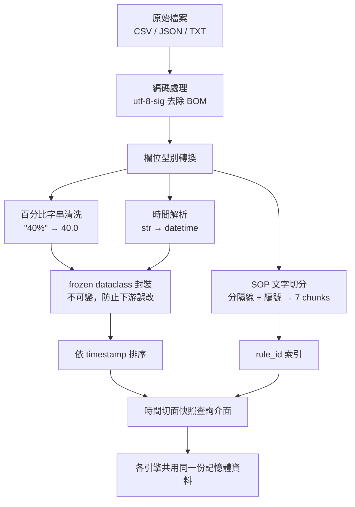

### 5.2 清洗規則詳述

| # | 問題 | 處理方式 | 實作位置 |
|---|---|---|---|
| 1 | **百分比字串** | `Roaming_User_Pct` 為 `"40%"` 格式，以正規式 `^\s*([0-9.]+)\s*%?\s*$` 抽取數值轉 float（`40.0`），解析失敗即拋錯而非靜默略過 | `data_loader._parse_pct` |
| 2 | **編碼汙染** | CSV 以 `utf-8-sig` 讀取，自動移除 Excel 寫入的 BOM，避免首欄名稱變成 `Timestamp` | `data_loader.load_traffic` / `load_crowd` |
| 3 | **時間格式** | 所有 `Timestamp` 以 `%Y-%m-%d %H:%M` 解析為 `datetime`；輸出時統一格式化回同一字串（SOP 第 6 條要求） | `data_loader.parse_ts` / `format_ts` |
| 4 | **資料不可變** | 每列轉為 `frozen=True` dataclass（`TrafficRecord` / `CrowdRecord` / `RoadSegment`），避免下游意外修改原始資料 | `data_loader` |
| 5 | **排序保證** | 載入後依 `timestamp` 排序，使「取某時刻最新快照」可線性掃描 | `data_loader.load_*` |
| 6 | **SOP 結構化** | 依分隔線與 `N. 標題` 切為 7 個 chunk，建立 `rule_id` 索引，供精準檢索 | `data_loader.load_sop_rules` |
| 7 | **What-if 隔離** | Sandbox 覆寫使用 `dataclasses.replace()` 產生新副本，正式資料永不變動 | `coordinator/whatif.py` |

### 5.3 時間切面機制

系統以「**時間切面**」為核心概念：任一時刻的系統狀態，等於各實體在該時刻（含）之前的最新一筆紀錄。

| 函式 | 語意 | 使用場景 |
|---|---|---|
| `traffic_snapshot(records, at)` | 每條路段在 `at` 前的最新一筆 | 分級判定、路徑排序、ETE |
| `crowd_snapshot(records, at)` | 每個場站在 `at` 前的最新一筆 | SOP 3／4／6 判定 |
| `crowd_peak(records, bs_id, until)` | 某場站在 `until` 前的歷史峰值人數 | SOP 4 大巨蛋散場（需歷史峰值 ≥30,000） |
| `all_timestamps(traffic, crowd)` | 合併去重的所有時間點 | 時序播放推進、時間軸 |

此設計確保車流與人流雖為不同取樣頻率（15 vs 18 個時間點），仍能在同一時間切面上一致比對。

---

## 6. 系統架構

### 6.1 分層架構

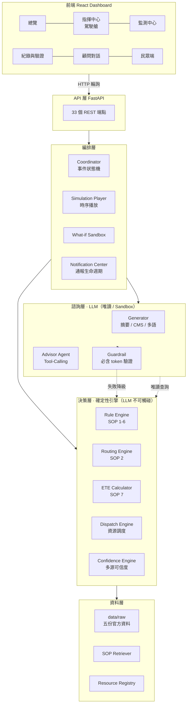

### 6.2 模組職責

| 模組 | 職責 | 明確**不**負責 |
|---|---|---|
| **Coordinator** | 接收 trigger、建立事件狀態、控制工作流、統一發布結果 | 猜測路徑、計算 ETE、決定 SOP 門檻 |
| **Rule Engine** | SOP 1–6 門檻判定、輸出證據數值 | 文字生成、路徑計算 |
| **Routing Engine** | SOP 2 候選篩選、上下游判定、排除理由 | 最短路徑演算法（MVP 不需要） |
| **ETE Calculator** | SOP 7 公式計算、保留原值與顯示值 | 修改 severity 或飽和度 |
| **Dispatch Engine** | 依規則產生資源需求、配置與缺口回報 | 自動搶佔（須人工核准） |
| **Confidence Engine** | 多源交叉驗證評分與證據句 | 參與任何 SOP 判定 |
| **LLM Generator** | 預警摘要、CMS 導引、多語告警 | 修改數值、新增條款 |
| **Advisor Agent** | 自主呼叫唯讀工具、查證後回答 | 發布通報、調度資源、核准動作 |

### 6.3 目錄結構

```
hackathon/
├─ backend/
│  ├─ app/
│  │  ├─ config.py                  # 路徑常數、時間格式
│  │  ├─ data_loader.py             # 載入、清洗、時間切面快照
│  │  ├─ notifications.py           # CMS 與多語模板（LLM fallback）
│  │  ├─ notifications_center.py    # 通報生命週期狀態機
│  │  ├─ engines/
│  │  │  ├─ rule_engine.py          # SOP 1-6 判定
│  │  │  ├─ routing_engine.py       # SOP 2 疏散路徑
│  │  │  ├─ ete_calculator.py       # SOP 7 恢復時間
│  │  │  └─ confidence.py           # 多源事件可信度
│  │  ├─ resources/
│  │  │  ├─ registry.py             # 資源庫存與配置
│  │  │  └─ dispatch_engine.py      # 調度政策與缺口
│  │  ├─ llm/
│  │  │  ├─ client.py               # Provider 偵測、結構化輸出、呼叫留痕
│  │  │  ├─ generator.py            # 三處官方要求的 LLM 生成
│  │  │  ├─ advisor.py              # 決策摘要、What-if 解析、問答
│  │  │  └─ agent.py                # Tool-Calling Agent 迴圈
│  │  ├─ coordinator/
│  │  │  ├─ coordinator.py          # 事件狀態機、調度、覆寫、回填
│  │  │  ├─ whatif.py               # Sandbox 假設分析
│  │  │  └─ whatif_nl.py            # 自然語言解析（regex 層）
│  │  ├─ retrievers/sop_retriever.py# 依 rule_id 精準取 SOP 原文
│  │  ├─ simulation/player.py       # 時序播放器
│  │  └─ api/main.py                # 33 個 REST 端點
│  └─ requirements.txt
├─ frontend/
│  └─ src/
│     ├─ App.tsx                    # 六頁導航、輪詢、全域狀態
│     ├─ Cockpit.tsx                # 指揮中心駕駛艙
│     ├─ MapView.tsx                # MapLibre 地圖圖層
│     ├─ views.tsx                  # 監測／驗證／顧問／民眾端／彈窗
│     ├─ components.tsx             # 共用元件（狀態卡、調度、通報、決策鏈）
│     ├─ GlobeIntro.tsx             # 總覽 landing（Canvas 2D 地球）
│     ├─ geometry.ts                # 示意座標（不參與判定）
│     ├─ api.ts                     # API 封裝與型別
│     └─ styles.css                 # 設計系統
├─ data/
│  ├─ raw/                          # 官方資料（authoritative）
│  └─ DATA_NOTES.md                 # 版本差異與 SHA256
├─ tests/
│  ├─ unit/                         # 12 檔 · 82 項
│  └─ integration/                  # 4 檔 · 23 項
└─ docs/
   ├─ SYSTEM_SPECIFICATION.md       # 本文件
   ├─ CitySentinel_提案簡報.pptx
   └─ build_deck.cjs
```

---

## 7. 系統功能

### 7.1 官方五大模組對照

| # | 官方要求 | 實作狀態 | 對應模組 |
|---|---|---|---|
| 1 | 動態時序監測儀表板（門檻由程式判定、摘要由 LLM 生成） | ✅ | `simulation/player.py` + `llm/generator.generate_alert_summary` |
| 2 | 突發事件注入與處置（60 秒內完成路網重規劃） | ✅ 實測 < 15 秒 | `coordinator.py` + `routing_engine.py` |
| 3 | 對話式策略諮詢（What-if 檢索 SOP 並回答） | ✅ | `llm/agent.py` + `coordinator/whatif.py` |
| 4 | 決策推理與解釋鏈（判定依據、排除理由、ETE 公式） | ✅ | decision_trace + `sop_retriever.py` |
| 5 | 多語化全通路通報（漫遊 ≥30% 自動產出） | ✅ 中英日韓 | `llm/generator.generate_multilingual` |

### 7.2 SOP 規則實作

| 條款 | 觸發條件 | 實作常數 |
|---|---|---|
| **SOP 1** 壅塞分級 | `< 0.85` 正常；`0.85–0.95` B 級；`≥ 0.95` A 級 | `LEVEL_B_THRESHOLD = 0.85`<br/>`LEVEL_A_THRESHOLD = 0.95` |
| **SOP 2** 車禍路障 | status ∈ {Closed, Blocked, Restricted} **且** severity ∈ {High, Critical} **且** segment 以 `RD_` 開頭（三項同時成立） | `INCIDENT_STATUSES`<br/>`INCIDENT_SEVERITIES` |
| **SOP 3** 捷運分流 | BL17 `Growth_Rate > 0.30` **或** `User_Count > 25,000` | `MRT_GROWTH_THRESHOLD = 0.30`<br/>`MRT_USER_THRESHOLD = 25000` |
| **SOP 4** 大巨蛋散場 | 歷史峰值 `≥ 30,000` **且** 當前 `Growth_Rate ≤ −0.20` | `DOME_PEAK_THRESHOLD = 30000`<br/>`DOME_DISPERSAL_GROWTH = -0.20` |
| **SOP 5** 號誌故障 | `type = Power_Failure` **或** 描述含「號誌失效／故障」 | `_SIGNAL_FAILURE_PATTERN` |
| **SOP 6** 多語通報 | 任一基地台 `Roaming_User_Pct ≥ 30%` | `ROAMING_THRESHOLD_PCT = 30.0` |
| **SOP 7** ETE | `base_clearance + max(0, (avg_sat − 0.5) × 60)` | `BASE_CLEARANCE = {Critical:60, High:40, Medium:20}`<br/>`PENALTY_BASELINE = 0.5`、`PENALTY_FACTOR = 60` |

### 7.3 路徑規劃規格（SOP 2）

**非最短路徑演算法，而是 SOP 約束下的候選篩選。**

| 步驟 | 規則 | 排除代碼 |
|---|---|---|
| 1 | 候選僅來自事故路段的 `alternatives`（單向，不可反向推導） | — |
| 2 | 排除 `capacity_vph < 1000` | `CAPACITY_BELOW_1000` |
| 3 | 排除未出現在事故路段 `intersections` 中者（非直接相交） | `NOT_DIRECT_INTERSECTION` |
| 4 | 排除路網中不存在的路段 | `UNKNOWN_SEGMENT` |
| 5 | 依事故位置文字比對 `intersections` 索引，判定上／下游 | — |
| 6 | 上游候選依 `Saturation_Score` 由低至高排序，第一名為主疏散 | 理由碼 `UPSTREAM`、`DIRECT_INTERSECTION`、`CAPACITY_OK`、`LOWEST_SATURATION` |
| 7 | 下游相交幹道僅列次要疏散 | `role_reason: DOWNSTREAM` |
| 8 | 主疏散若已壅塞（≥0.85）仍保留，加註長綠燈與大眾運輸建議 | `CONGESTED_KEEP_WITH_LONG_GREEN` |

### 7.4 資源調度規格

**資源庫存（預設）**

| 資源 ID | 類型 | 標籤 | 總量 | ETA |
|---|---|---|---:|---:|
| POL-01 | Police | 交通警力 A 組 | 8 | 6 分 |
| POL-02 | Police | 交通警力 B 組 | 4 | 9 分 |
| SHU-01 | Shuttle | 公車處接駁車隊 | 6 | 8 分 |
| SIG-01 | SignalMaintenance | 號誌搶修組 | 4 | 12 分 |
| SIGC-01 | SignalControl | 號誌時制控制台 | 3 | 1 分 |
| MRT-01 | MRTLiaison | 北捷行控聯絡窗口 | 2 | 2 分 |

> 警力總量刻意設為 12，使三起事件併發即出現資源競爭，可於 Demo 展示優先權抽調。

**調度規則**

| 觸發條款 | 資源需求 |
|---|---|
| SOP 2（Critical） | 警力 4（封鎖 2 + 上游淨空 2）+ 號誌控制 1（替代道路長綠燈） |
| SOP 2（High/其他） | 警力 2（現場管制）+ 號誌控制 1 |
| SOP 3（事件本身為該基地台時） | 北捷聯絡 1 + 接駁車 2 + 警力 2 |
| SOP 5 | 警力 `2 × 受影響路口數` + 號誌搶修 1 |

**優先權**：`Critical(3) > High(2) > Medium(1) > Low(0)`，僅允許高優先抽調低優先。

### 7.5 可信度評分規格

| 訊號 | 條件 | 加權 |
|---|---|---:|
| 事件來源 | 官方事件（`TPE_` 開頭） | +0.50 |
| 事件來源 | 自訂注入事件 | +0.30 |
| 車流異常 | 車速 ≤ 10 km/h | +0.20 |
| 車流異常 | 飽和度 ≥ 0.95（車速未崩跌時） | +0.15 |
| 車道狀態 | ∈ {Accident_Impact, Blocked, Gridlock, Closed} | +0.15 |
| 周邊人流 | 周邊場站 `\|Growth_Rate\| ≥ 0.30`（取一次） | +0.10 |

分數上限 0.99；等級：`≥0.75` 高、`≥0.50` 中、其餘低。
**分數僅供指揮官參考排序，不參與任何 SOP 判定。**

### 7.6 LLM 功能與護欄

| 功能 | 官方對應 | 護欄機制 |
|---|---|---|
| 預警情勢摘要 | 模組 1 | 門檻已由程式判定，LLM 僅解釋；快取避免重複呼叫 |
| CMS 導引文字 | 模組 2 | **必含 token**：路名、ETE 數字缺一即整段退回模板 |
| 多語告警 | 模組 5 | **四語數字不變性**：時間戳與 ETE 須原樣出現於每一語言，任一缺失則四語整包退回 |
| 決策摘要 | — | `cited_rule_ids` 必須是已觸發條款子集，否則棄用 |
| What-if 解析 | 模組 3 | 站點／路段 ID 必須存在，否則拒絕 |
| 顧問 Agent | 模組 3 | 工具允許清單唯讀；迴圈上限 5 輪；引用由工具軌跡推導 |

---

## 8. 核心流程圖

### 8.1 事件處理工作流（狀態機）

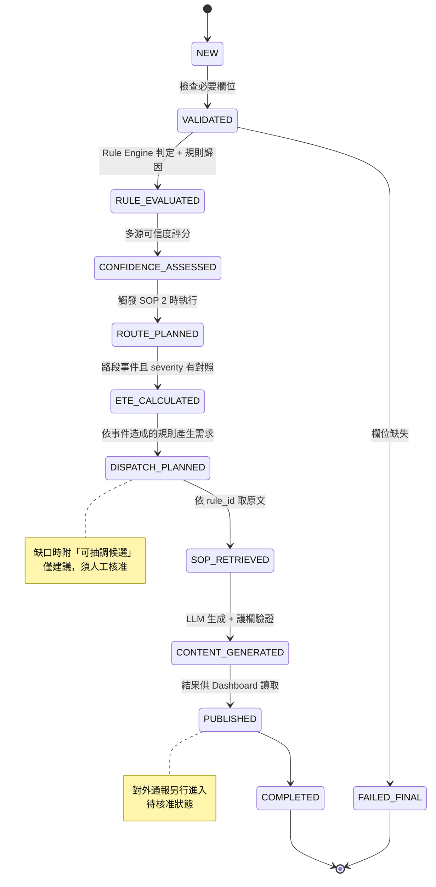

### 8.2 路徑規劃決策流程

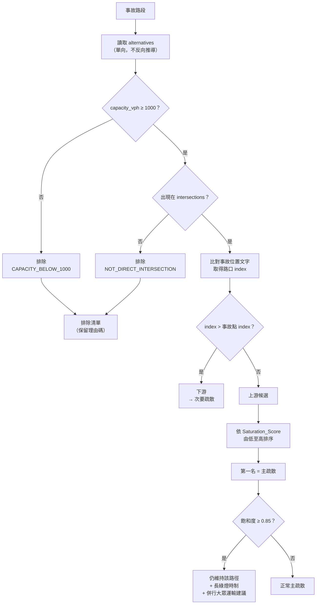

### 8.3 LLM 生成與護欄流程

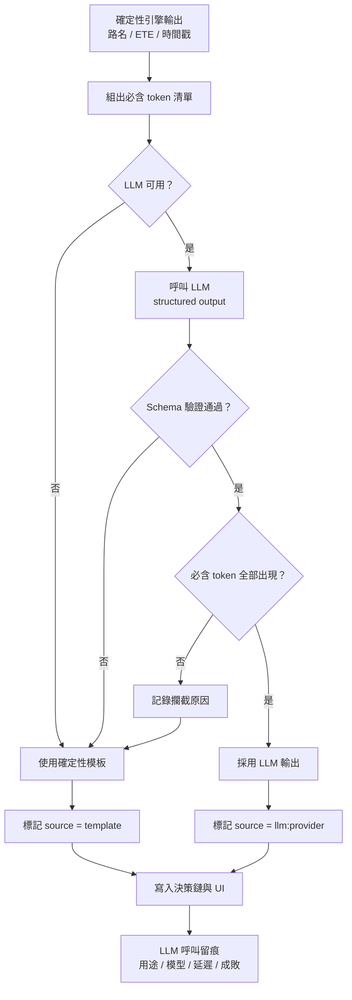

### 8.4 Tool-Calling Agent 迴圈

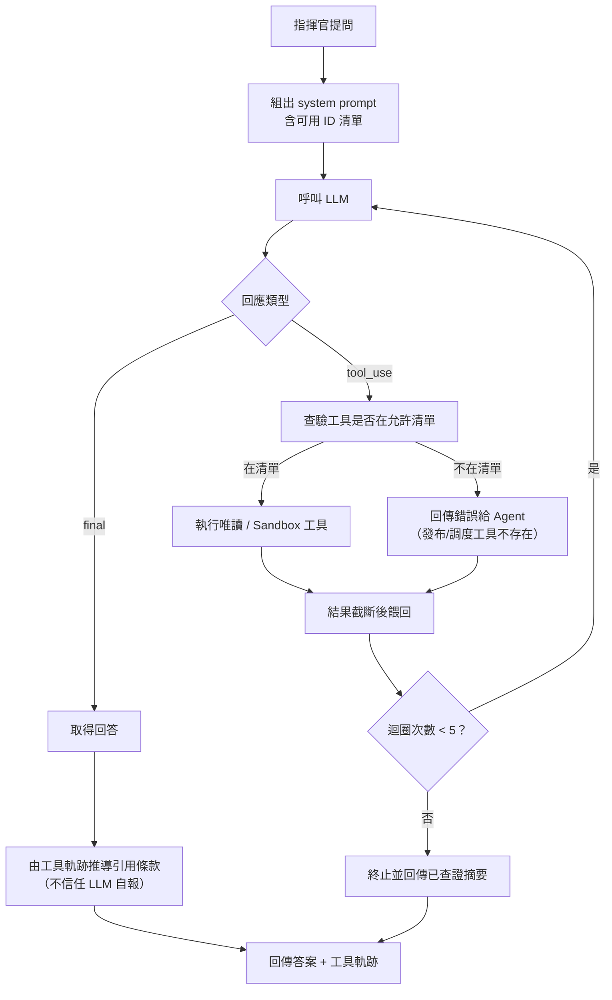

### 8.5 通報生命週期

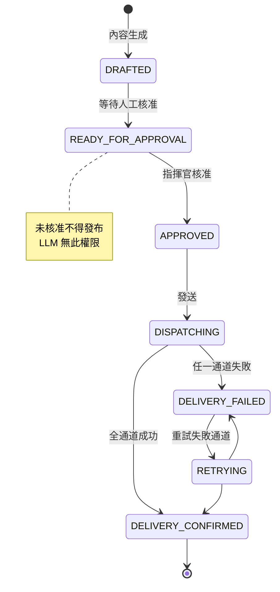

通道：`CMS`（路側可變資訊看板）、`SMS`（細胞廣播簡訊）。Demo 使用模擬 Adapter，SMS 首次發送必失敗以展示重試閉環。

其中僅 `SMS` 直達民眾手機（`CITIZEN_CHANNELS`）。通報的整體 `status` 是給指揮中心看的營運狀態——任一通道失敗即 `DELIVERY_FAILED`；民眾端是否顯示警報則另由 `citizen_reached` 判定，避免「CMS 失敗」被誤讀為「民眾沒收到」，或反之。

### 8.6 資源調度與優先權抽調

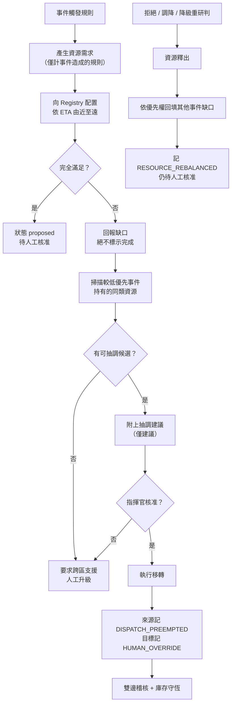

### 8.7 使用者操作流程

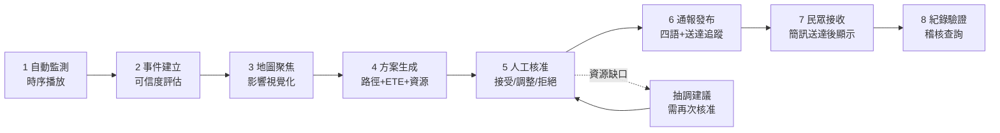

### 8.8 時序播放流程

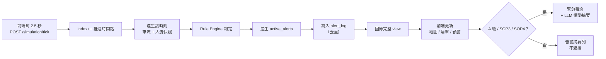

---

## 9. API 規格

Base URL：`http://localhost:8000`　共 **33 個端點**

### 9.1 基礎資料

| 方法 | 路徑 | 說明 |
|---|---|---|
| GET | `/api/health` | 健康檢查、資料載入狀態 |
| GET | `/api/road-network` | 路網 15 路段完整資料 |
| GET | `/api/sop` | SOP 7 條原文 |
| GET | `/api/provenance` | **資料佐證**：來源檔 SHA256、筆數、引擎門檻常數 |

### 9.2 時序播放

| 方法 | 路徑 | 說明 |
|---|---|---|
| POST | `/api/simulation/start` | 啟動播放（`speed`、`start_timestamp`） |
| POST | `/api/simulation/pause` | 暫停 |
| POST | `/api/simulation/seek` | 跳轉至指定時間 |
| POST | `/api/simulation/tick` | 推進一個時間點 |
| GET | `/api/simulation/state` | 當前快照與預警 |
| GET | `/api/simulation/alerts` | 累積預警紀錄 |
| GET | `/api/simulation/timeline` | 時間軸與事件 marker |
| GET | `/api/history` | 趨勢時序資料（受模擬時間限制） |

### 9.3 事件處理

| 方法 | 路徑 | 說明 |
|---|---|---|
| POST | `/api/incidents/inject` | 注入官方事件 |
| POST | `/api/incidents/custom` | **自訂事件**（Pydantic schema 驗證 + 實體存在性檢查） |
| GET | `/api/incidents` | 可用／已處理事件清單 |
| GET | `/api/incidents/{id}` | 事件完整狀態 |
| GET | `/api/incidents/{id}/decision-trace` | **決策鏈**（規則歸因、路徑、ETE、SOP 原文） |
| GET | `/api/simulation-runs` | 自訂事件模擬紀錄 |

### 9.4 資源調度

| 方法 | 路徑 | 說明 |
|---|---|---|
| GET | `/api/resources` | 資源庫存與可用量 |
| POST | `/api/resources/reset` | 重置庫存（Demo 用） |
| GET | `/api/incidents/{id}/dispatch` | 調度動作與證據包 |
| POST | `/api/incidents/{id}/dispatch/{action_id}` | **人工指揮**：`accept` / `reject` / `adjust` / `preempt` |

### 9.5 通報

| 方法 | 路徑 | 說明 |
|---|---|---|
| GET | `/api/notifications` | 通報清單與生命週期狀態 |
| POST | `/api/notifications/{id}/{op}` | `approve` / `dispatch` / `retry` |
| GET | `/api/incidents/{id}/notifications` | 該事件的通報內容 |

### 9.6 AI 功能

| 方法 | 路徑 | 說明 |
|---|---|---|
| POST | `/api/alerts/summary` | **預警摘要**（LLM 生成，含快取） |
| POST | `/api/incidents/{id}/ai-summary` | **交控決策摘要**（含護欄驗證） |
| POST | `/api/advisor/chat` | **顧問對話**（Tool-Calling Agent，失敗降級確定性路由） |
| POST | `/api/what-if` | 結構化 What-if Sandbox |
| POST | `/api/what-if/nl` | 自然語言 What-if（regex → LLM 兩層） |
| GET | `/api/llm/status` | 當前 LLM provider 狀態 |

### 9.7 稽核與驗證

| 方法 | 路徑 | 說明 |
|---|---|---|
| GET | `/api/logs` | **統一系統紀錄**（監測預警／事件處理／人工覆寫／通報／模擬／LLM） |
| GET | `/api/confidence` | 各事件可信度與證據 |

---

## 10. 資料模型

### 10.1 核心資料結構（frozen dataclass）

```python
@dataclass(frozen=True)
class RoadSegment:
    segment_id: str
    name: str
    flow_direction: str
    intersections: tuple[str, ...]   # 上游→下游排序
    capacity_vph: int
    alternatives: tuple[str, ...]    # 單向建議
    nearby_stations: tuple[str, ...]

@dataclass(frozen=True)
class TrafficRecord:
    timestamp: datetime
    segment_id: str
    road_name: str
    avg_speed: float
    vehicle_count: int
    saturation_score: float
    lane_status: str

@dataclass(frozen=True)
class CrowdRecord:
    timestamp: datetime
    bs_id: str
    location_name: str
    user_count: int
    stay_time_avg: float
    growth_rate: float
    roaming_user_pct: float          # 已清洗為數值
```

### 10.2 事件狀態（Incident State）

| 欄位 | 型別 | 說明 |
|---|---|---|
| `incident_id` | str | 事件識別碼 |
| `workflow_status` | str | `processing` / `completed` / `failed` |
| `current_step` | str | 當前狀態機步驟 |
| `event` | dict | 原始事件內容 |
| `as_of` | str | 時間切面 |
| `triggered_rules` | list[int] | 所有觸發條款 |
| `rule_attribution` | dict | **規則歸因**：`caused_by_incident` / `context_rules` / `calculation_rules` |
| `trigger_details` | list[dict] | 各觸發的證據數值與處置動作 |
| `confidence` | dict | 可信度分數、等級、證據句 |
| `routing_result` | dict | 主／次疏散、排除清單與理由碼 |
| `ete_result` | dict | 公式、原值、顯示值、飽和度來源路段 |
| `dispatch` | dict | 調度動作、缺口、優先級、抽調候選 |
| `sop_evidence` | list[dict] | 引用的 SOP 條款原文 |
| `notifications` | dict | CMS、四語內容、生成來源標記 |
| `notification_id` | str | 對應通報生命週期物件 |
| `decision_trace` | list[dict] | **決策鏈**：每步驟名稱、時間、細節 |
| `ai_summary` | dict | LLM 決策摘要（選用） |

### 10.3 決策鏈步驟

| 步驟 | 記錄內容 |
|---|---|
| `VALIDATED` | 欄位檢查結果 |
| `RULE_EVALUATED` | 事件造成條款、情境參考條款 |
| `CONFIDENCE_ASSESSED` | 分數、等級、訊號數 |
| `ROUTE_PLANNED` | 主疏散、排除清單與理由碼 |
| `ETE_CALCULATED` | 分鐘數與完整公式 |
| `DISPATCH_PLANNED` | 動作數、嚴重度、缺口、抽調提案數 |
| `SOP_RETRIEVED` | 取回的條款編號 |
| `CONTENT_GENERATED` | 通報 ID、生成來源、護欄攔截紀錄 |
| `PUBLISHED` | Dashboard 更新、通報待核准狀態 |
| `HUMAN_OVERRIDE` | 操作者、操作類型、理由、時間、原建議值 |
| `DISPATCH_PREEMPTED` | 被抽調數量、抽調者、核准人 |
| `RESOURCE_REBALANCED` | 回填數量、剩餘缺口 |
| `FAILED_FINAL` | 錯誤訊息 |

---

## 11. 測試規格

**總計 105 項，全數通過（執行時間約 2.4 秒）**

### 11.1 單元測試（12 檔 · 82 項）

| 檔案 | 項數 | 覆蓋範圍 |
|---|---:|---|
| `test_rule_engine.py` | 11 | 分級邊界 0.84／0.85／0.95、BL17 門檻 25000／25001、成長率 0.31、漫遊 29.9%／30%、SOP 4 雙條件、SOP 2 三條件、SOP 5 雙路徑 |
| `test_dispatch.py` | 9 | 配置扣量、跨資源池、缺口回報、釋出還原、重置、SOP 2／5 需求、環境規則不驅動調度、缺口不標完成 |
| `test_advisor_agent.py` | 9 | 七項工具執行、Sandbox 隔離、允許清單外拒絕、錯誤回饋、迴圈上限、引用推導、LLM 停用行為 |
| `test_llm_generator.py` | 9 | CMS 成功／漏路名／改數字／降級、多語成功／缺數字／缺時間戳、預警摘要降級、Coordinator 整合 |
| `test_whatif_nl.py` | 8 | 人數／萬倍數／別名／漫遊率／時間解析／封路／負成長率／長別名優先／無法解析 |
| `test_ete_calculator.py` | 7 | Critical+0.5=60、High+0.8=58、Medium 懲罰不為負、文件範例 81.6、多路段平均、未知 severity、原值與顯示值分離 |
| `test_routing_engine.py` | 6 | 容量 999 排除、非相交排除、下游不得為主疏散、壅塞仍保留、alternatives 不可雙向、無位置預設上游 |
| `test_confidence.py` | 5 | 全訊號高分、自訂事件低分、無車流資料註記、分數上限、Coordinator 整合 |
| `test_advisor_guardrails.py` | 5 | LLM 不可用降級、引用未觸發條款攔截、強制人工核准、編造 ID 拒絕、合法 ID 通過 |
| `test_notifications_center.py` | 5 | 初始待核准、未核准不得發布、完整生命週期含重試、已確認不可重試、核准者留痕 |
| `test_dispatch_flex.py` | 5 | 缺口提出抽調建議、抽調雙邊稽核、同級禁止抽調、拒絕觸發回填、降級釋出回填 |
| `test_coordinator_summary.py` | 3 | 四段結構、確定性欄位、無事件時行為 |

### 11.2 整合測試（4 檔 · 23 項）

| 檔案 | 項數 | 覆蓋範圍 |
|---|---:|---|
| `test_dispatch_integration.py` | 7 | 三起官方事件調度、規則歸因不誤調、重新注入不重複扣量、拒絕歸還、調整保留原建議 |
| `test_demo_scenarios.py` | 6 | 資料載入驗證、ACC_001 完整流程、EVT_002 人流事件、EVT_003 號誌故障、What-if 隔離、主動監測門檻 |
| `test_advisor_chat_api.py` | 5 | What-if 路由、SOP 查詢路由、fallback、provenance SHA256、可信度端點 |
| `test_custom_incident_api.py` | 5 | 未知路段拒絕、時間格式拒絕、enum 拒絕、完整流程、通報生命週期 API |

### 11.3 測試策略

| 原則 | 做法 |
|---|---|
| 確定性 | `conftest.py` 設定 `CITY_LLM_DISABLED=1`，測試不呼叫外部 LLM |
| LLM 行為驗證 | 以 monkeypatch 模擬 LLM 回應，驗證護欄攔截邏輯 |
| 真實資料 | 整合測試使用官方原始資料，非 mock 資料 |
| 邊界優先 | 所有 SOP 門檻皆測試邊界值（如 0.84／0.85、25000／25001） |

---

## 12. 效能與限制

### 12.1 效能實測

| 項目 | 實測值 | 官方要求 |
|---|---|---|
| 純運算延遲（Rule + Routing + ETE） | < 100 ms | — |
| 事件注入端到端（含 2 次 LLM 生成） | < 15 秒 | 60 秒內 |
| 測試套件執行 | 2.4 秒（105 項） | — |
| LLM 單次呼叫延遲 | 2–8 秒（依用途） | — |
| 前端輪詢週期 | 2.5 秒 | — |

> 測試環境：Windows 11、本機執行、OpenAI `gpt-4o-mini`。LLM 延遲取自系統紀錄實測值。

### 12.2 系統規模

| 項目 | 數值 |
|---|---:|
| 後端程式行數 | 3,713 |
| 前端程式行數 | 3,394 |
| API 端點 | 33 |
| 自動化測試 | 105 |
| 前端頁面 | 6 |

---

## 13. 部署架構

### 13.1 AWS 參考架構

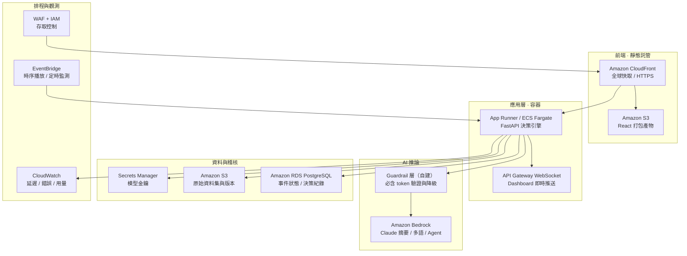

### 13.2 設計考量

| 考量 | 說明 |
|---|---|
| 無狀態容器 | 決策引擎不持有跨請求狀態，可水平擴展 |
| 模型可替換 | LLM 推論與決策運算解耦，模型故障不影響判定輸出 |
| 資料落地 | 稽核資料留存於客戶 VPC 內的 RDS，符合公部門要求 |
| 金鑰管理 | 模型金鑰集中於 Secrets Manager，不進入程式碼或容器映像 |

> 本節為建議部署架構，對應官方交付要求之「AWS 架構圖」。目前系統於本機環境完成開發與驗證，尚未實際部署至 AWS。

---

## 14. 已知限制與後續規劃

### 14.1 已知限制（誠實聲明）

| 項目 | 限制說明 |
|---|---|
| **地圖座標** | 主辦資料未提供經緯度，`frontend/src/geometry.ts` 為信義／大安區近似示意座標。**所有 SOP 判定、路徑篩選、ETE 計算均不使用這些座標**，UI 上亦明確標註 |
| **即時推送** | 目前採 2.5 秒輪詢，尚未實作 WebSocket 推送 |
| **H3 區域風險層** | 因無 H3 資料層與路段幾何鄰接關係，未實作區域風險格網，改以路段線平滑變色呈現 |
| **回放完整性** | 時間條可 seek 車流／人流快照與地圖狀態，但資源庫存、通報送達等事件驅動狀態不隨時間回溯還原 |
| **身分驗證** | `operator` 欄位為自由字串，未實作帳號系統與角色權限（RBAC）|
| **AWS 部署** | 架構已設計，尚未實際部署 |
| **拖曳調度** | 未實作地圖拖曳指派資源，採一鍵調度與抽調核准 |

### 14.2 後續規劃

| 階段 | 項目 |
|---|---|
| 短期 | WebSocket 即時推送、AWS 部署、角色權限分離 |
| 中期 | 接入即時資料源（真實車流／信令）、擴充至全市路網、H3 區域風險層 |
| 長期 | 跨災害調度 Adapter（積水／地震／停電／火災）、歷史案例 RAG、趨勢預測模型 |

---

## 附錄 A：設計原則總結

1. 五大模組是**使用者功能**，不是五個自由對話 Agent
2. 一個 Coordinator 管理流程，所有模組共用同一份事件狀態
3. **SOP、Routing、ETE、Dispatch 必須由程式運算**
4. LLM 只負責自然語言解析、解釋與多語生成
5. 地圖是決策呈現，不是城市遊戲模擬
6. Demo 劇本可固定，但結果需依當下資料真正運算
7. 系統保留完整決策軌跡，讓評審看見 AI 如何感知、判定與處置
8. **即使 LLM 全數失效，確定性決策核心仍正常運作**
9. 人保有最終指揮權：核准、調整、拒絕皆可，且全程留痕

## 附錄 B：相關文件

| 文件 | 用途 |
|---|---|
| `README.md` | 快速開始與各階段進度摘要 |
| `data/DATA_NOTES.md` | 資料版本差異與 SHA256 紀錄 |
| `docs/CitySentinel_提案簡報.pptx` | 提案簡報（18 頁） |
| `docs/build_deck.cjs` | 簡報產生器（可重現） |
| `docs/PROJECT_DOCUMENTATION.md` | Phase 1–2 早期快照（已過時，僅供歷史參考） |
